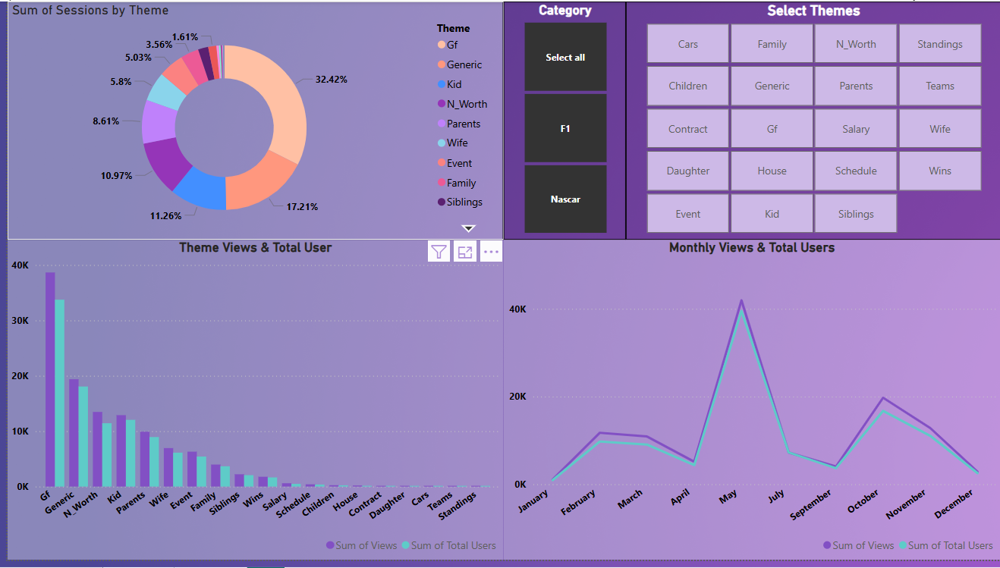
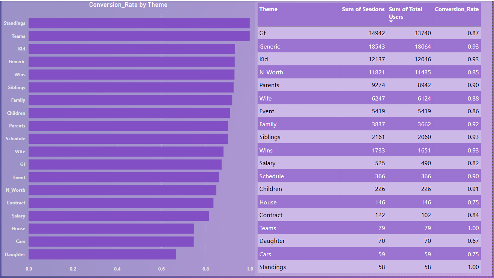
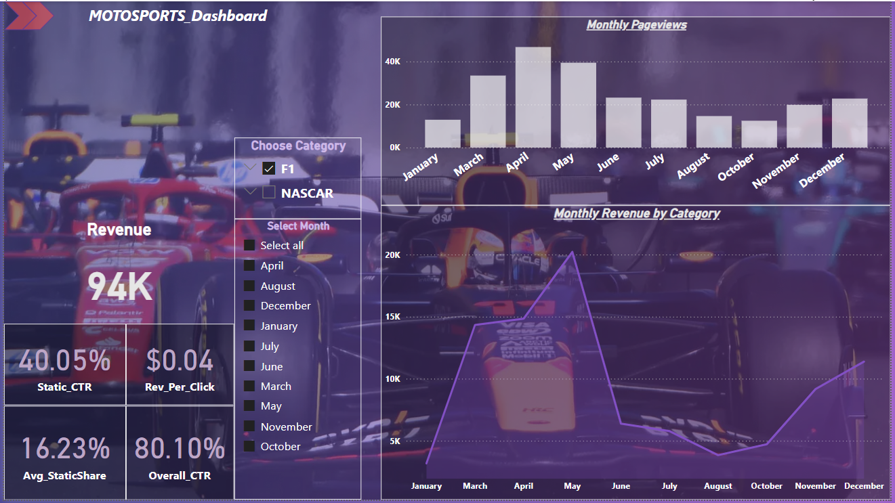

# 📊 Theme & Revenue Performance Dashboards (Power BI)

## 📘 Overview
This Power BI project combines two performance dashboards:
1. **Theme Performance Dashboard** – Analyzes user engagement and conversion across content themes.
2. **Motorsports Monthly Revenue Dashboard** – Tracks revenue and ad metrics across motorsport categories (F1 & NASCAR).

These dashboards enable content teams and analysts to derive actionable insights for strategy and monetization.

---

## 📊 Dashboard 1: Theme Performance

### 📸 Genre_1:


### 📸 Genre_2:


### 🔍 Visuals & Features
- **Conversion Rate by Theme**: Compare efficiency in converting sessions to users.
- **Sessions by Theme (Donut)**: Identifies traffic-heavy content themes.
- **Views vs Users**: Highlights the volume of engagement for each theme.
- **Monthly Trends**: Spot seasonal patterns in usage.
- **Slicers for Interaction**: Filter by category and theme.

### 🧠 Key Insights
- **Top Converting Themes**: Standings, Teams, and Kid.
- **Highest Volume Drivers**: Gf, Generic, Kid.
- **Low Performers**: Cars, Daughter, and Contract underperform.
- **Seasonality**: Clear engagement spike in **May** and **November**.

---

## 📈 Dashboard 2: Motorsports Monthly Revenue

### 📸 Rev:


### 🔍 Visuals & Features
- **Revenue KPI (94K)**: Filterable total revenue metric.
- **CTR & Rev Metrics**: Includes Static CTR, Rev/Click, Avg Static Share, Overall CTR.
- **Monthly Pageviews (Bar)**: Tracks audience growth and drops.
- **Monthly Revenue by Category (Line)**: F1 and NASCAR monthly trends.
- **Interactive Filters**: Category & month slicers for focused analysis.

### 🧠 Key Insights
- **Best Revenue Month**: May leads in revenue and traffic.
- **F1 Dominance**: Drives majority of views and revenue.
- **CTR Optimization**: Static CTR is strong (40.05%), but revenue per click is low ($0.04).
- **Engagement Gap**: August–September show performance dips needing intervention.

---

## 🛠 DAX Metrics Used

```dax
Conversion_Rate = DIVIDE([Sum of Sessions], [Sum of Total Users])
Sessions_per_User = DIVIDE([Sum of Sessions], [Sum of Total Users])
Revenue_per_Click = DIVIDE([Total Revenue], [Total Clicks])
Overall_CTR = DIVIDE([Total Clicks], [Total Impressions])
